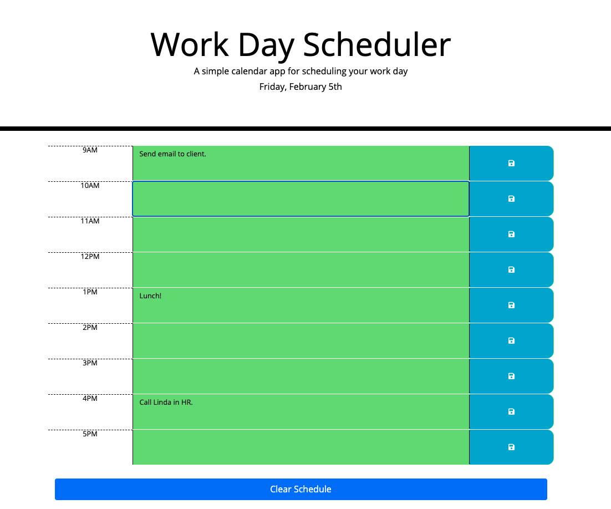

# Work_Day_Scheduler

## Description

The motivation for building this application was the desire to create an application that uses moment.js and jQuery to dynamically update HTML and CSS. This application also greatly uses the Web Storage API.

The reason for building this specific project was the need for a daily planner that stores important events in order to effectively manage time.

Moment.js was used for this application in order to display the current time, and also for the purpose of dynamically updating time blocks to display past, present, and future events.

## Application Images

### Scheduler Image

## Installation

No prior installation is required to use the Work Day Scheduler application.

# Usage

1. Head to the deployed link provided further down.
1. You will notice that the current day is displayed above the time blocks.
1. Once in the application you can begin inputting your events into the corresponding time blocks.
    1. In order to save the event simply click on the blue save button on the right of that specific event.
    1. You will notice that past events will be highlited gray, the current event will be highlighted red, and upcoming events will be highlighted in green.
1. To clear all currently saved events simply click on the 'Clear Schedule' button at the bottom of the application.

## Deployed Link

https://martinmondaca.github.io/Work_Day_Scheduler/

## Technologies Used

* https://jquery.com/
* https://momentjs.com/
* https://getbootstrap.com/
* https://fontawesome.com/

## License

Licensed under [MIT](https://choosealicense.com/licenses/mit/) license.